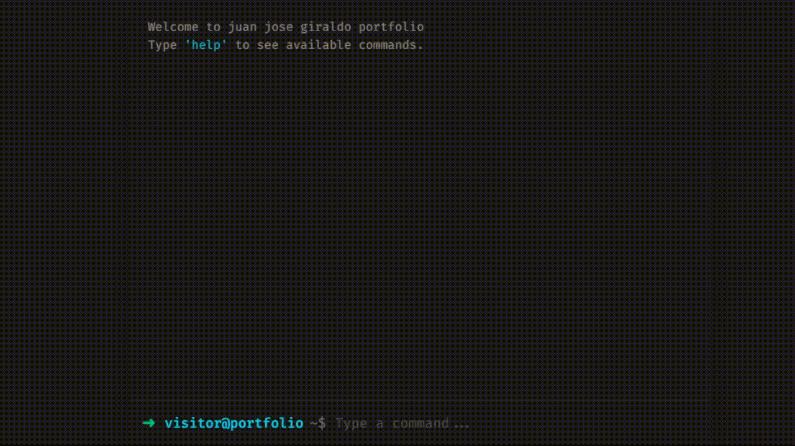

# Terminal Portfolio

A highly interactive, terminal-inspired personal portfolio website built with React and Tailwind CSS. It features realistic typing animations, command-based navigation, and customizable themes to showcase your work in a developer-friendly format.



## Features

- 🖥️ **Interactive Terminal Interface**: Fully functional command-line interface simulation.
- ⚡ **Real-time Typing Animations**: Smooth, realistic output rendering.
- 🎨 **Theming Support**: Switch between different color schemes (e.g., Matrix, Drifter, Peach).
- 🧩 **Command History**: Navigate through previous commands using Up/Down arrow keys.
- 📱 **Responsive Design**: optimized for both desktop and mobile viewing.
- 📂 **Auto-completion**: Tab completion for available commands.

## Tech Stack

- **React**: Component-based UI architecture.
- **Tailwind CSS**: Utility-first styling for the retro terminal aesthetic.
- **Vite**: Blazing fast build tool and development server.

## Getting Started

Follow these steps to run the project locally on your machine.

### Prerequisites

- Node.js installed (v16+ recommended)
- npm or yarn

### Installation

1. Clone the repository:
   ```bash
   git clone https://github.com/juanjoscript/cli-portfolio.git
   cd cli-portfolio
   ```

2. Install dependencies:
   ```bash
   npm install
   ```

3. Start the development server:
   ```bash
   npm run dev
   ```

4. Open your browser and navigate to `http://localhost:5173`.

## Usage

Type `help` to see a list of available commands.

Common commands usually include:
- `about`: Learn more about the developer.
- `projects`: View my projects.
- `contact`: Get contact information.
- `clear`: Clear the terminal screen.
- `theme`: Change the color theme.

## Customization

You can easily customize the content, simply edit the `src/config.js` or `src/commands.js` files to update your personal information, links, and project details.
